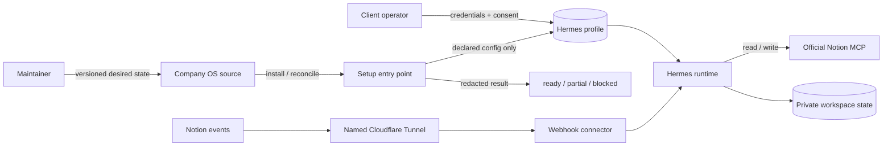
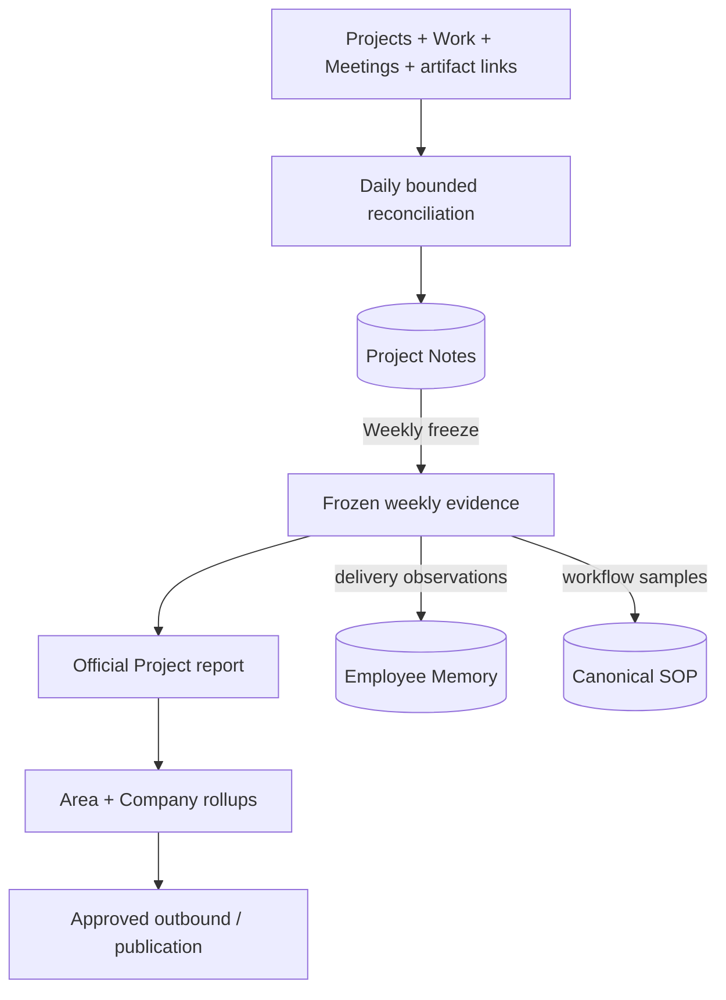

# PRD: Seamless Company OS deployment, operating memory, and tuning

## Product decision

The first external installation exposed two connected problems:

1. “One click” still meant platform-specific commands, separate workspace and
   automation setup, custom Notion tooling, and manual verification.
2. Daily and Weekly automations had no clear private memory layer between live
   Work and the reports or records they publish.

The product must therefore provide:

- one resumable install, reconcile, and verify command;
- profile-local secrets, auth, schedules, and runtime state;
- Markdown report templates as the human tuning surface;
- one private Project Notes file per active Project and week;
- Weekly projections from those notes into reports, Employee Memory, and SOPs;
- a typed `ready | partial | blocked` receipt with one exact next action.

“One click” may still pause for credentials, browser OAuth, Notion sharing,
deploy approval, or spend approval. It must not bypass external consent.

## Users and jobs

| User | Job |
| --- | --- |
| Client operator | Install, authorize, verify, update, and recover the Company OS without learning Hermes internals. |
| Manager | See assigned, active, stale, blocked, completed, and documentation-pending Work from source evidence. |
| Maintainer | Change a Markdown report template and keep its Pydantic contract, example, rendering, and QA in sync. |

## Release scope

The next release supports one macOS/Linux path, one proven Windows path, and a
persistent Docker topology. One deterministic entry point owns install,
reconcile, update, health, and eval phases. Chat may wrap that command but is
not required to run it.

MCP is the default provider access route. Notion comments remain a separate
inbound-event boundary: a remotely managed named Cloudflare Tunnel exposes the
connector. The customer creates the hostname and route once; setup stores only
the tunnel token in the Hermes profile, installs no Cloudflare CLI, and rejects
temporary Quick Tunnel URLs.

## System boundaries

This diagram answers: **who owns configuration, credentials, runtime state, and
provider access?**



| Owner | Owns | Must not own |
| --- | --- | --- |
| Company OS source | Distribution, workspace/templates, automation contracts, reconciliation policy, health checks, feature evals | Client credentials, sessions, generated reports, private memory |
| Hermes profile | Secrets, OAuth, MCP configuration, scheduler, plugins, local databases | Repo-authored desired state |
| Runtime workspace | Generated reports, Project Notes, Employee Memory, proposals, receipts | Source templates treated as co-equal edited copies |
| Operator | Credentials, OAuth consent, Notion sharing, deploy topology, external-write approval | Hidden manual repair steps |
| Notion/Drive | Destination permissions and document visibility | Private intermediate management state unless explicitly published |

Unknown client files must survive install and update. Distribution updates may
change only the declared allowlist. `hermes profile export` remains a snapshot
or backup, not the update channel.

## Operating memory

This diagram answers: **how does live Work become short-term memory, reports,
and persistent entity memory?**



Project Notes are private working memory, not a public report or employee
scorecard. Daily appends source-linked snapshots and findings under fixed
Markdown sections. The first implementation keeps one notes file per Project
and week—not separate Daily employee or workflow files.

### Daily reconciliation

Daily reads active Projects and this union of Work:

```text
all open Work
+ changed since last successful watermark
+ Done Work pending documentation review
+ Work with unresolved documentation questions
```

Full page content is fetched only for changed, stale, blocked, Done, or
unresolved records. Daily appends a complete Work snapshot only when its source
revision changes. Weekly groups snapshots by stable Work ID and selects the
greatest source update time. Materially different snapshots tied at that time
block consolidation; source revisions identify snapshots but are not sorted.

Staleness comes from the last meaningful status, comment, artifact, acceptance,
or human update. An automation touch does not reset it. Elapsed time comes from
sourced timestamps and remains `unknown` when a timestamp is missing. It is not
presented as employee effort or a performance rating.

When Work becomes Done:

```text
Done Work
   |
   v
Documentation review
   | sufficient                    | missing information
   v                               v
extract outcome + artifacts       record one precise question
   |                               |
   v                               v
Completed outcomes section        keep Work open in weekly notes
```

### Weekly lifecycle and recovery

This diagram answers: **what resets, what persists, and what happens after a
failed rollup or late answer?**

```mermaid
stateDiagram-v2
  [*] --> Active: first Daily run
  Active --> Active: append changed source snapshots
  Active --> Frozen: Weekly boundary
  Frozen --> Frozen: projection fails / retry
  Frozen --> Consolidated: all projections validate
  Consolidated --> Active: retain frozen week; seed next week
```



Weekly validates every candidate projection before persistent memory changes.
On success it:

1. writes the official Project report;
2. merges factual delivery observations into Employee Memory by employee and
   source Work ID;
3. proposes source-linked workflow samples to the canonical SOP;
4. produces Area and Company rollups, then approved outbound material;
5. retains the consolidated week's frozen notes immutably and seeds next week
   with unresolved Work and documentation questions.

Closed Work stops carrying forward after its accepted outcome is retained in
the official report and Employee Memory. A late answer stays linked to its
original Work ID and is consumed by the next Daily run. An immutable report is
corrected only when reporting policy requires it. If projection validation
fails, persistent memory stays unchanged and the frozen notes remain retryable.

### Template-to-Pydantic contract

The Markdown template supplies the section instructions, field vocabulary,
enum values, and golden examples. Template sync must show the generated Pydantic
diff before changing the schema. Daily performs one structured extraction; a
deterministic mapper routes the result back into Markdown and Weekly sinks.

| Template section | Structured concepts | Weekly destination |
| --- | --- | --- |
| Work and employee updates | Work ID, owner, state, timestamps, staleness, blocker, next action, documentation state, expected/observed artifact, evidence | Project report; Employee latest-week evidence; unresolved items carry forward |
| Completed outcomes and artifacts | Outcome, accepted artifacts, completion/acceptance time, elapsed duration, documentation result, optional workflow key, evidence | Project report; Employee Memory |
| Documentation questions | Work/question ID, open state, exact missing fact, update location, evidence checked | Project report; Employee latest-week evidence; open questions carry forward |
| Problems and inefficiencies | Workflow step, condition, impact, recurrence/volume, time/wait loss, sourced cost, confidence/gaps, next proof | Reports; Issue candidates |
| Decisions | Choice, rationale/tradeoff, authority, evidence, review trigger | Project report; approved decision destination |
| Workflow and SOP signals | Explicit workflow key, trigger, actors, method, systems/handoffs, output artifact type, exceptions, controls, timing samples, confidence, promotion state | Canonical SOP candidate/update |
| Carry-forward items | Original Work ID, source note keys, unresolved state/question, owner, next action, source week | Next week's Project Notes only |

One Daily sample may not establish or silently replace an SOP baseline. Weekly
must preserve the sample count, evidence window, prior value, approval state,
and rollback evidence.

## User stories

| ID | User story | Acceptance |
| --- | --- | --- |
| US-001 | Install from one entry point. | Clean supported host/profile works and resumes; a blocked step gives one exact action; unchanged rerun creates no duplicates. |
| US-002 | Update from repo-owned configuration. | Installed source/version is visible; only distribution-owned state changes; profile secrets, auth, memory, sessions, and generated state survive. |
| US-003 | Use Notion without a local adapter stack. | Interactive mode uses official hosted MCP and bounded tools; receipts separate MCP health from webhook health; headless/event routes are explicit. |
| US-004 | Tune behavior through output templates. | One representative template yields or validates its structured contract and realistic example; schema/eval drift fails with an actionable diff. |
| US-005 | Verify the whole installation. | Static health, live probes, scheduler readiness, and feature evals remain separate; skipped probes never pass; receipts contain no secrets or private records. |
| US-006 | Learn and recover without tribal knowledge. | A new operator follows the tested path without reading source or legacy pages; docs QA runs every documented command and receipt. |
| US-007 | Track weekly delivery without employee self-scoring. | Daily appends changed Work snapshots with stable IDs; Weekly selects the greatest sourced update time per Work while using source revision only for identity and deduplication; Done Work passes documentation review; elapsed duration is not called effort or performance. |
| US-008 | Consolidate weekly evidence into persistent entity memory. | Weekly freezes and validates before promotion; Employee Memory merges by person and Work ID; SOP updates retain sample history; failed projections leave memory unchanged. |

## Functional requirements

### Setup and deployment

- **FR-1:** Prove the native, Windows, and Docker topology matrix before locking
  the installer.
- **FR-2:** Provide one cross-platform, non-chat entry point for install,
  reconcile, update, health, and eval.
- **FR-3:** Keep secrets and OAuth material in Hermes-owned profile state. Repo
  files may declare names, endpoints, tool allowlists, and desired state.
- **FR-4:** Reuse Hermes profile install/update, MCP, cron, plugin, config, and
  doctor capabilities where they meet this contract.
- **FR-5:** Make each phase idempotent and produce a redacted resumable receipt
  with observed state and `next_action`.
- **FR-6:** Default Notion read/write to official hosted MCP. Treat webhook
  ingress and unattended access as separate capabilities.
- **FR-7:** Bind each versioned report template to a compatible Pydantic/JSON schema,
  realistic example, renderer, and QA.
- **FR-8:** Install the health policy and frozen feature eval entry points with
  the distribution.
- **FR-9:** Organize setup docs around installation, authorization, operation,
  update, verification, and recovery.

### Operating memory

- **FR-10:** Maintain one private append-only Project Notes file per active
  Project and week from bounded Daily reads.
- **FR-11:** Extend the Daily Pydantic result and mapper with Work timing/state,
  documentation questions, accepted outcomes/artifacts, and workflow samples.
- **FR-12:** Freeze the complete Project Notes set before creating Project, Area, Company,
  Employee Memory, SOP, or outbound projections.
- **FR-13:** Store only factual, source-linked Employee Memory observations. Do
  not infer personality, unsourced effort, or automatic performance ratings.
- **FR-14:** Update SOP timing only through a versioned, auditable sample policy
  with approval and rollback evidence.
- **FR-15:** Carry unresolved Work and questions into the next week's notes. Remove
  closed Work only after retaining its accepted outcome evidence.

## Success and proof

| Claim | Required proof |
| --- | --- |
| Supported topology | Fresh install and idempotent rerun on one Windows path and one persistent Docker path, with no undocumented repair. |
| Honest health | `ready | partial | blocked` receipt; skipped or unauthorized probes cannot appear healthy. |
| Safe update | Tests prove secrets stay profile-local, unknown files survive, and only allowlisted desired state changes. |
| Template tuning | Template-contract drift test covers schema, example, renderer, and eval output. |
| Operating memory | Daily/Weekly evals prove stable-ID reconciliation, documentation branches, frozen projection input, carry-forward, and failed-promotion recovery. |
| Provider access | One official Notion MCP OAuth/read probe; webhook health tested separately. |

Record cold-install and warm static-verify durations. Do not set a performance
target until the topology PoC produces a representative baseline.

## Constraints and human gates

- Never put token values in receipts, logs, docs, git, or chat.
- Static reconcile must avoid network calls unless live verification is chosen.
- The supported contract cannot require a POSIX-only shell. Windows may use
  WSL2 or Docker if the PoC proves and documents that route.
- Reuse Hermes primitives before adding product-specific code.
- The setup command may inspect and reconcile declared source-owned state and
  run bounded tests. It may not grant Notion access, complete OAuth consent,
  enable production writes, expose a public endpoint, spend money, or delete
  user-owned state.
- Plan, real-machine QA, deploy/publish, spend, and destructive migration each
  require their named human approval.

## Non-goals

- Modify or ship Hermes itself from this repository.
- Support every Windows shell or make OAuth zero-click.
- Replace Notion webhooks with MCP.
- Use hosted Notion MCP as a headless bearer-token service.
- Enable production writes or external publication by default.
- Build a general-purpose installer framework.
- Rewrite every record template or feature eval in the first slice.

## Risks and open proof

- Hosted Notion MCP requires user OAuth and does not by itself serve an
  unattended headless container.
- MCP provides read/write tools, not Notion's inbound webhook event stream.
- Hermes chat permissions may block shell/CLI access; setup cannot depend on
  weakening that boundary.
- Distribution update preserves `config.yaml` by default. The desired-state
  contract must distinguish repo-owned and local settings.
- Free-form Markdown cannot safely define every semantic schema rule without a
  compatibility check.
- Clean Windows and Docker runners, a deterministic live MCP probe, packaged
  eval fixtures, and a secret-safe receipt validator are still required.

## Implementation status

The local operating-memory slice is implemented. Daily reconciles bounded Work
into source-linked Project Notes, including completed outcome/artifact rows and
documentation questions. Weekly freezes the complete all-Project set, then
produces report, Employee Memory, SOP sample, promotion, and carry-forward
projections. Employee observations merge by Person and Work; workflow samples
merge by explicit workflow key without automatically changing an approved
baseline.

The remaining gates are external: bind authenticated client destinations and
operate separately authorized Notion, Drive, messaging, Windows, and persistent
Docker proof. The next Daily run is the accepted re-review path for unanswered
documentation questions; event-driven re-review is not required for this
release. FEAT-0011 and TASK-0016 through TASK-0021 own setup and deployment
proof.

## Grounding

- **User evidence:** first external-computer deployment feedback in this task.
- **Local evidence:** `distribution.yaml`, TASK-0015, setup scripts, schemas,
  templates, evals, and installed Hermes CLI/help/docs.
- **Provider evidence:** official Notion hosted MCP documentation describes
  OAuth-based read/write access; official webhook documentation requires a
  separate public HTTPS endpoint for `comment.created` delivery.
