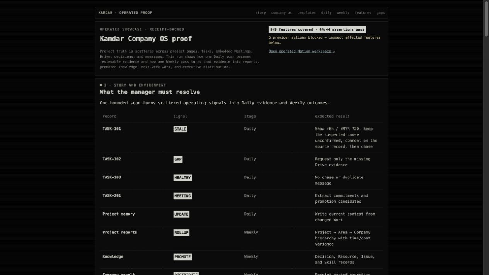
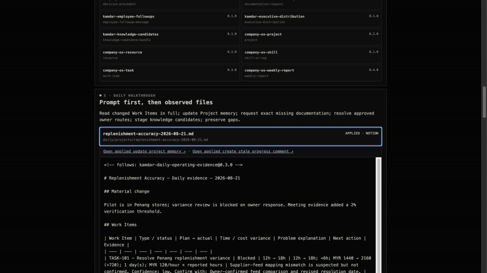

# Operated v4 proof reconciliation

## Boundary

The operated demo is an isolated child of the preflighted Kamdar parent, not a
production Kamdar source. It is seeded only from the frozen fixture and is the
only environment that the live eval edge may write.

- [Demo root](https://app.notion.com/p/Kamdar-AI-Eval-Demo-3c3d43a239428112b2e1e0a3628b9587)
- [Proof index](https://app.notion.com/p/Proof-3c3d43a2394281f79098e378e407210f)

## Company OS records verified after write

| Database | Rows | Review link | What proves it |
| --- | ---: | --- | --- |
| Projects | 2 | [Open](https://app.notion.com/p/90221bfcfd6349ffb2b4ebf57750a07d) | Fixture Projects remain the durable parent for Daily memory and Weekly plan child evidence. |
| Work | 7 | [Open](https://app.notion.com/p/f2fff399db774df38f9da0f92f66362e) | Four source Work items, two Meeting-derived Task proposals, and one promoted Issue. |
| People | 2 | [Open](https://app.notion.com/p/02a1348bee7341a08dd6829156595978) | Owner routes used before any off-platform chase. |
| Decisions | 1 | [Open](https://app.notion.com/p/4d6c46fef3314c61b034337b676d2854) | Approved pilot threshold promoted from the Meeting signal. |
| Resources | 1 | [Open](https://app.notion.com/p/275f848136aa4c839b024028670778e4) | Verified three-store method with source-backed quality. |
| Reports | 5 | [Open](https://app.notion.com/p/9ccf015bffd84ddb9762d1ca808cdab2) | Two Project reports, two Area rollups, one Company rollup. |
| Skills | 1 | [Open](https://app.notion.com/p/8e69765601a64cea9cc94562e76520d5) | SOP signal promoted only after the Weekly gate. |
| Templates | 14 | [Open](https://app.notion.com/p/3cdca1a6c3074eb39e4e824eef8eaabe) | Exact source-controlled template contracts visible inside the demo. |

## Critical behavior re-read

- `TASK-101` has exactly the mapped documentation request and one progress
  comment. The latter asks for current state, blocker owner, root-cause
  evidence, revised commitment date, and explanation for the recorded
  time/cost variance.
- `TASK-102` has exactly one narrow documentation comment requesting only the
  missing Evidence field.
- `TASK-104` exists exactly once in Work with the clean title `TASK-104 —
  Upload manual count evidence`. Its Weekly planning artifact is [linked child
  evidence](https://app.notion.com/p/Weekly-plan-2026-W34-3c3d43a239428134929aea8babe80d88), not another Work row.
- The earlier erroneous v4 duplicate is recoverably in Notion trash. No
  production or older-v3 record was changed.

## Results and delivery truth

- Operated run: **44/44 assertions pass** across **9/9 features**.
- There are **18 applied Notion actions**, each with a receipt-backed result
  URL in the generated showcase.
- A second operated pass left the action count at 18, Work at 7 rows,
  `TASK-104` at one row, and `TASK-101` at two comments.
- Drive and email are blocked by expired Google authentication; Telegram is
  blocked because no target is configured. The showcase says `BLOCKED` rather
  than presenting a fake delivery.

## Run-root isolation

- The frozen comparison is now written to
  `runs/kamdar-template-first-frozen-latest/`.
- The operated, receipt-backed showcase remains in
  `runs/kamdar-template-first-latest/`.
- The local proof server serves the operated root when it exists; `POST
  /api/run` writes only the frozen root. A regression test proves a UI frozen
  comparison cannot replace the operated showcase.

## Showcase verification

The served `/showcase` reads the current operated output, has `cache-control:
no-store`, contains the current Weekly child URL above, and contains no URL to
the trashed duplicate. A fresh 1280px browser capture confirms the intended
768px centered column (`x=248.5`) and 13px core type; it also records an
expanded Daily artifact with its exact applied Notion links.





## Commands

```text
node --test evals/filesystem/tests/*.test.mjs
python3 -m unittest discover -s tests -p 'test_*.py' -v
python3 scripts/validate_company_context.py --context workspace.hermes.md
node evals/filesystem/scripts/template-first-kamdar.mjs
node evals/filesystem/scripts/live-kamdar-poc.mjs
curl -fsS http://127.0.0.1:4179/api/result/latest
```

All commands completed successfully after the repair: frozen and operated
results each pass 44/44, while the served surface remains operated.
